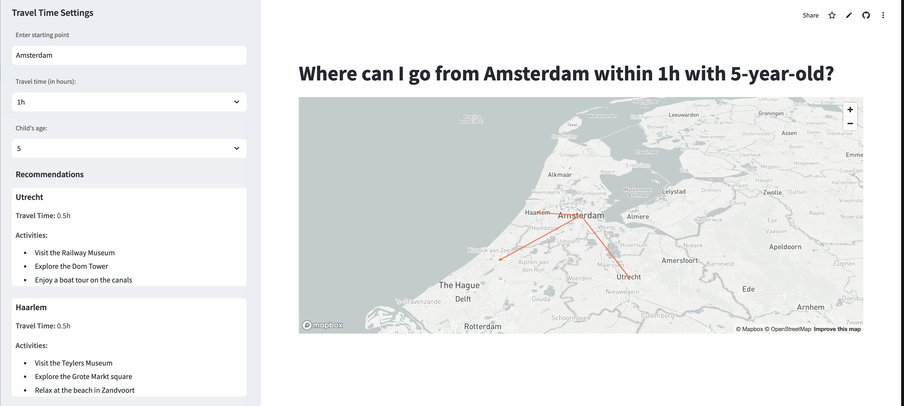

# Travel-Time-App

A Streamlit app that recommends family-friendly destinations reachable by public transport within a selected time from your starting point.

## 🚀 Live Demo

Try the app here: **[https://travel-time.streamlit.app/](https://travel-time.streamlit.app/)**

## 📸 Screenshot


*Interactive map showing family-friendly destinations and travel routes*

## ✨ Features

- 🗺️ **Interactive Map**: Visualizes destinations and travel routes using PyDeck
- 🤖 **AI-Powered Recommendations**: Uses OpenAI's language model to suggest family-friendly destinations
- ⏰ **Customizable Travel Time**: Choose from 30 minutes to 3 hours of travel time
- 👶 **Age-Appropriate Activities**: Tailored suggestions based on your child's age

## 🛠️ Setup

### Prerequisites
- Python 3.8 or higher
- OpenAI API key

### Installation

1. **Clone the repository**
   ```bash
   git clone https://github.com/lanfeitiao/Travel-Time-App.git
   cd Travel-Time-App
   ```

2. **Create a virtual environment** (recommended)
   ```bash
   python -m venv venv
   source venv/bin/activate 
   ```

3. **Install dependencies**
   ```bash
   pip install -r requirements.txt
   ```

4. **Set up environment variables**
   
   Create a `.env` file in the project root:
   ```bash
   OPENAI_API_KEY=your_openai_api_key_here
   ```

## 🚀 Running the App

Run the Streamlit application with:

```bash
streamlit run app.py
```

The app will open in your browser at `http://localhost:8501`

## 🎯 How to Use

1. **Enter your starting point** (e.g., "Amsterdam", "London", "New York")
2. **Select travel time** (30 minutes to 3 hours)
3. **Choose your child's age** (0-18 years)
4. **Explore recommendations** in the sidebar and view destinations on the interactive map

## 🏗️ Built With

- **[Streamlit](https://streamlit.io/)** - Web framework
- **[PyDeck](https://pydeck.gl/)** - Interactive map visualization
- **[OpenAI API](https://openai.com/)** - AI-powered destination recommendations

## License

This project is licensed under the MIT License. See [LICENSE](LICENSE) for details.
